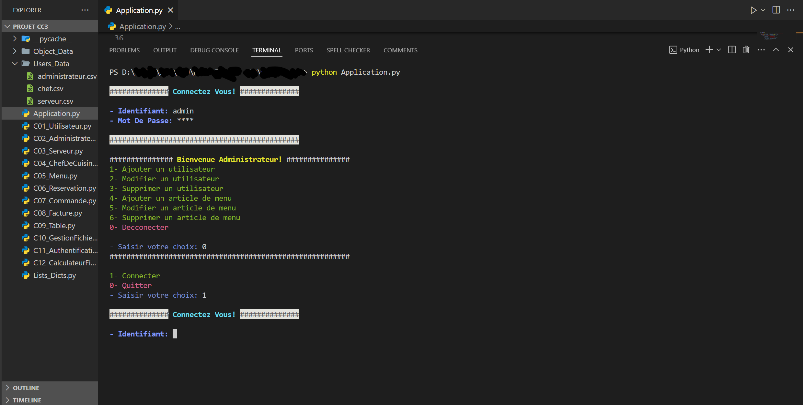

# 🍽️ Restaurant Management System (with Login)



A Restaurant Management System built with Python. This project includes a secure login system and uses a CSV file as the database. It’s designed to help manage restaurant Admins, Servers, and Chefs. And functionality through a text-based interface like manage users, menu, bills, reservations, commandes and more... Every user have a different page based on his post (Admin, Server, or Chef)

---

## 🔧 Technologies Used

- **Python**
- `csv` (for data storage)
- `maskpass` (for hidden password input)
- `types.SimpleNamespace` (for structured data handling)

---

## 🔐 Features

- User login system
- Password masking
- CSV-based data management
- Easy-to-read and modify Python code

---

## ▶️ How to Run

1. Clone the repository:
    ```sh
    git clone https://github.com/Amine4jh/py-restaurant-management.git
    ```

3. Navigate to the project folder:
    ```sh
    cd py-restaurant-management
    ```

2. Install required libraries:
    ```sh
    pip install maskpass
    ```

4. Run the application:
    ```sh
    python Application.py
    ```
